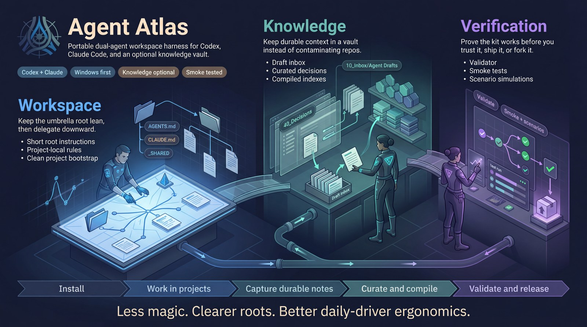
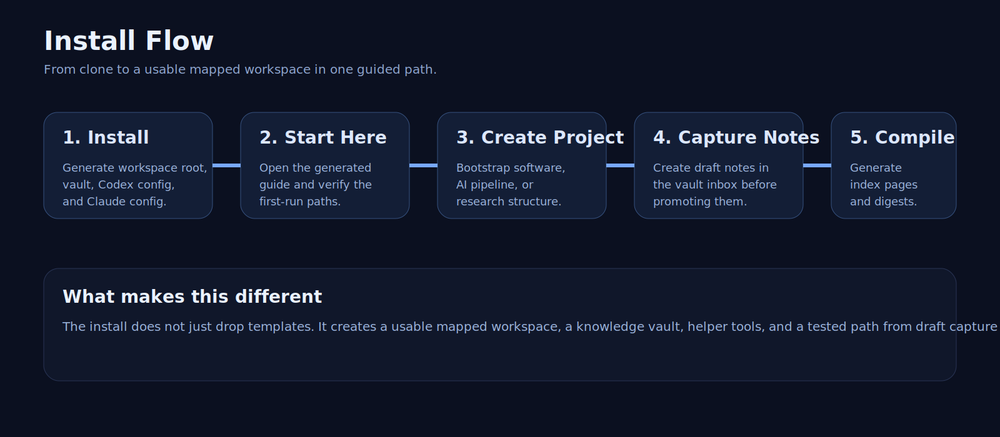
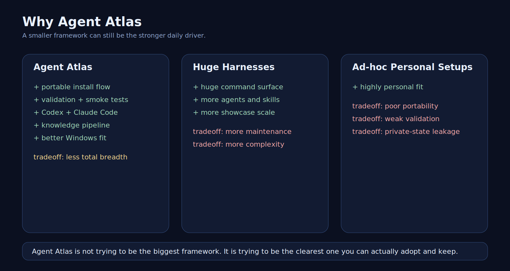
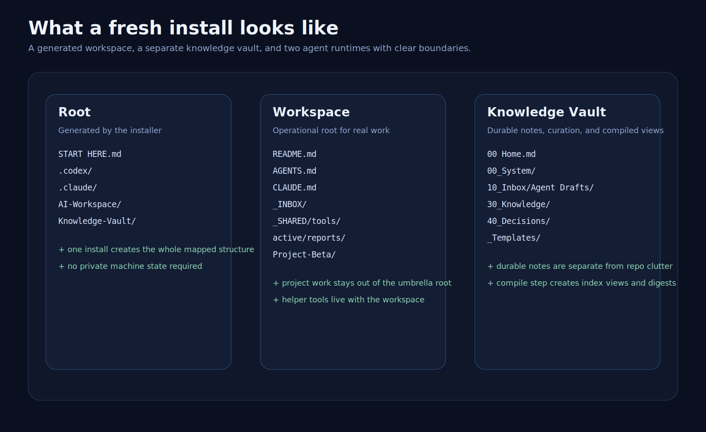

<p align="center">
  
</p>

<h1 align="center">Agent Atlas</h1>

<p align="center">
  Portable dual-agent workspace harness for <code>Codex</code>, <code>Claude Code</code>, and an optional Obsidian knowledge layer.
</p>

<p align="center">
  
  
  
  
  
  <a href="https://github.com/Akaro96/agent-atlas/actions/workflows/validate.yml"></a>
</p>



This repository is a productized, open-source-friendly distillation of a real high-usage local setup. It is designed for people who want:

- short, high-signal root instructions
- clean `workspace -> project -> path` hierarchy
- strong verification instead of “trust me” harnesses
- a durable knowledge layer without turning notes into uncontrolled agent memory
- current library and API docs through a separate live-docs layer

## What This Is

This kit ships four ideas that work well together:

1. `Codex` is structure-driven.
2. `Claude Code` is hook- and specialist-friendly.
3. the workspace root stays lean and delegates downward
4. durable knowledge lives in a separate Markdown vault instead of contaminating operational repos

Public name:

- `Agent Atlas`

Repository slug:

- `agent-atlas`

## Modules

- `templates/codex/`: portable Codex root guidance and config template
- `templates/claude/`: portable Claude Code guidance and settings template
- `templates/workspace/`: umbrella-workspace docs and local rule examples
- `templates/obsidian/`: optional knowledge-layer docs
- `scripts/Install-AgentWorkspaceKit.ps1`: scaffold a portable workspace + vault
- `scripts/New-WorkspaceProject.ps1`: create a clean new project under a scaffolded workspace
- `scripts/Validate-AgentWorkspaceKit.ps1`: validate this repo for publishability and template integrity
- `scripts/Invoke-KitSmokeTests.ps1`: run end-to-end smoke tests against a fresh generated install
- `scripts/New-ReleaseBundle.ps1`: create a validated distributable release bundle
- `examples/`: sample workspace and sample vault

## Design Goals

- portable, not machine-bound
- opinionated, but not bloated
- auditable
- Windows-friendly without pretending Windows is Linux
- useful even if you only adopt half the system

## At A Glance

- **Use this if** you want a serious daily-driver harness that stays understandable.
- **Skip this if** you want the biggest possible workflow operating system with hundreds of commands and maximum framework sprawl.
- **Core bet**: clearer roots beat more magic.

## Branding

- `Agent Atlas` uses a project-specific mark inside this repository; it does not require changing a maintainer's GitHub account avatar.
- Current logo assets live in [assets/logo/README.md](./assets/logo/README.md).
- Use [assets/logo/agent-atlas-mark-square.png](./assets/logo/agent-atlas-mark-square.png) as the current master raster and [assets/logo/agent-atlas-mark-avatar-512.png](./assets/logo/agent-atlas-mark-avatar-512.png) for compact repo-facing placements.

## Quick Start

1. Clone this repo somewhere clean.
2. Run:

```powershell
pwsh -File .\scripts\Install-AgentWorkspaceKit.ps1 `
  -DestinationRoot "D:\AgentWorkspace" `
  -OwnerName "Your Name" `
  -WorkspaceName "AI-Workspace" `
  -VaultName "Knowledge-Vault"
```

3. Open the generated workspace root in your preferred agent CLI or app.
4. Start project work in a real project folder, not the umbrella root.

The installer creates portable starter configs under `DestinationRoot\.codex\` and `DestinationRoot\.claude\`.
It does not silently overwrite your live home-directory agent config.

If you want the shortest possible walkthrough, read [docs/quickstart.md](./docs/quickstart.md).

If you want the guided first-run experience, read [docs/first-run-walkthrough.md](./docs/first-run-walkthrough.md).

## Recommended Layout

```text
DestinationRoot/
  AI-Workspace/
    README.md
    AGENTS.md
    CLAUDE.md
    .claude/
    _INBOX/
    _SHARED/
    _ARCHIVE/
  Knowledge-Vault/
    README.md
    AGENTS.md
    CLAUDE.md
    00 Home.md
```

## Validation

Run the repository validator before publishing changes:

```powershell
pwsh -File .\scripts\Validate-AgentWorkspaceKit.ps1
```

The validator checks:

- required repository files
- script syntax
- JSON/TOML parseability for templates
- markdown links and image targets
- accidental hardcoded personal paths
- accidental references to the original local username

Run end-to-end smoke tests when you want stronger confidence:

```powershell
pwsh -File .\scripts\Invoke-KitSmokeTests.ps1
```

Run scenario simulations when you want to prove broader real-world install and release flows:

```powershell
pwsh -File .\scripts\Invoke-KitScenarioSimulations.ps1
```

Create a release bundle when you want a clean distributable ZIP:

```powershell
pwsh -File .\scripts\New-ReleaseBundle.ps1
```

## Why This Exists

Most public harnesses are either:

- too magical
- too gigantic
- too tied to one agent
- too hand-wavey about verification
- too personal to be publishable

This kit aims for a narrower but more robust middle ground.

## Comparison

See [docs/comparison.md](./docs/comparison.md) for positioning against larger public harnesses.
See [docs/positioning.md](./docs/positioning.md) for the sharper public differentiation story.
See [docs/why-agent-atlas.md](./docs/why-agent-atlas.md) for the practical case for choosing this over larger competitors.



## Why Choose This Instead Of Bigger Competitors

- clearer split between operational workspace, durable knowledge, and live docs
- better fit if you mix `Codex` and `Claude Code`
- stronger Windows story than many Linux-shaped harness repos
- lean enough to maintain without turning your setup into a second job
- includes validation and smoke tests instead of only aspirational docs

## Architecture

See [docs/architecture.md](./docs/architecture.md) for the layered model and portability rules.

## Showcase

See [docs/showcase.md](./docs/showcase.md) for what a generated install actually looks like.
See [docs/migration-guide.md](./docs/migration-guide.md) if you are moving from a giant harness, a dotfiles dump, or a one-agent-only setup.
See [docs/repo-tour.md](./docs/repo-tour.md) for the fastest guided tour of the repository.

## Built-in Workspace Tools

The generated workspace includes portable helper scripts under `_SHARED/tools/`:

- `Invoke-WorkspaceDoctor.ps1`: generate a health report for a generated workspace
- `Search-Vault.ps1`: search the linked knowledge vault
- `New-VaultInboxNote.ps1`: create durable draft notes in the vault inbox
- `Promote-VaultDraft.ps1`: promote a draft note into a curated knowledge area
- `Compile-VaultKnowledge.ps1`: compile curated notes into generated vault index pages




## FAQ

See [docs/faq.md](./docs/faq.md) for practical questions such as:

- Do I need both Codex and Claude Code?
- Do I need Obsidian?
- Is this safe by default?
- Can I use only the workspace part?
- What should I customize first?

## Roadmap

See [docs/roadmap.md](./docs/roadmap.md) for the intended next steps.

## Knowledge Pipeline

See [docs/knowledge-pipeline.md](./docs/knowledge-pipeline.md) for the `capture -> curate -> compile -> use` model.

## Releases

See [docs/release-process.md](./docs/release-process.md) for the release bundle flow.
See [docs/github-launch-plan.md](./docs/github-launch-plan.md) for the public GitHub launch sequence.

## Vision

See [VISION.md](./VISION.md) for the public naming and positioning logic.

## License

MIT. See [LICENSE](./LICENSE).
