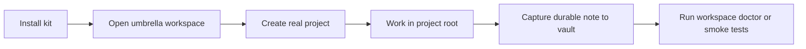

# Showcase

## What You Get After Install

```text
DestinationRoot/
  START HERE.md
  .claude/
    CLAUDE.md
    settings.json
  .codex/
    AGENTS.md
    config.toml
  AI-Workspace/
    README.md
    AGENTS.md
    CLAUDE.md
    _INBOX/
    _SHARED/
      tools/
        Invoke-WorkspaceDoctor.ps1
        Search-Vault.ps1
        New-VaultInboxNote.ps1
        Promote-VaultDraft.ps1
        Compile-VaultKnowledge.ps1
    _ARCHIVE/
  Knowledge-Vault/
    00 Home.md
    00_System/
    10_Inbox/
      Agent Drafts/
    20_Projects/
    30_Knowledge/
    40_Decisions/
    _Templates/
```

## Why This Is Better Than A Dotfiles Dump

- templates instead of private live state
- installer instead of hand-copy instructions
- smoke tests instead of “works on my machine”
- validator that checks for personal path leakage
- examples that show the intended layering model
- a knowledge compiler instead of only a raw note bucket
- a release-bundle flow instead of “zip the repo by hand”

## Typical Flow


